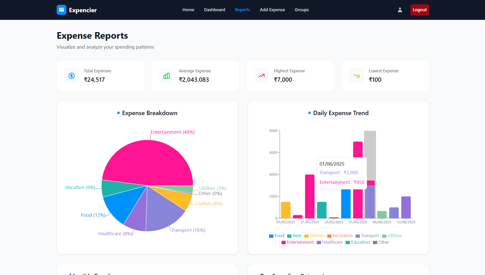
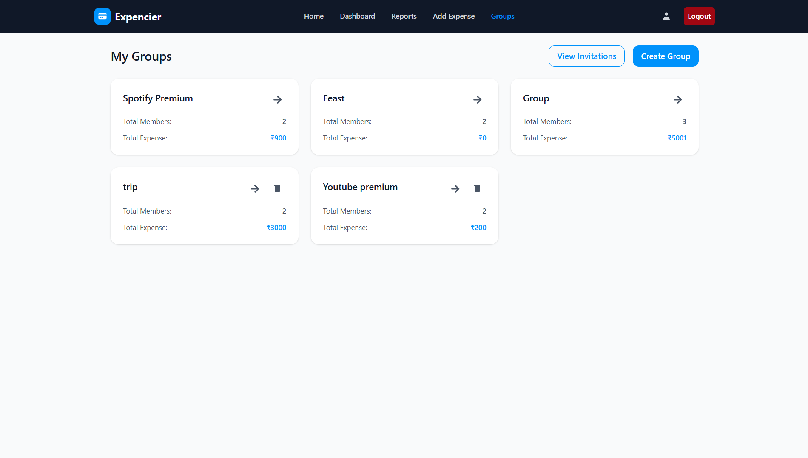

## Expencier
A full-stack personal and group expense management platform year: 2025   <b>Live: </b><a href="http://expencier.vercel.app/" target="_blank"> Link </a>

 frontend: <b>@</b><a href="https://github.com/ZayedShahcode/Expense_Tracker" target="_blank"><b>ZayedShah</b></a>   backend: <b>@</b><a href="https://github.com/siddharthramagiri/Expense-Tracker-Backend" target="_blank"><b>Sidduramagiri</b></a>

### Entity Relation

The Expense Tracker Application is a full-stack financial management system designed to help individuals and groups easily manage, categorize, and split their expenses. The platform supports both **personal budgeting** and **group expense tracking** - ideal for roommates, friends on trips, or project collaborators.

Built with a Java Spring Boot backend and a React.js frontend, the system emphasizes **real-time updates**, **multi-user collaboration**, and **secure data handling**.

## Smart Group Splitting & Reconciliation

Beyond traditional personal trackers, the app includes robust support for **group expenses**. Users can create or join groups, add shared expenses, and automatically split costs using fair distribution logic. The backend calculates balances, and the UI shows who owes whom - all in real time.

<h2>
  Designed for Transparency and Ease
</h2>

We wanted the experience to feel intuitive yet powerful. Each expense entry supports:
- Description, category, and tags
- Amount and currency
- Participants and split logic
- Receipt uploads (coming soon)

Every group has a dedicated dashboard that shows individual and total balances, so there’s **zero ambiguity** in shared transactions.

## Full-Stack Engineering with Spring Boot & React

The backend is powered by **Java Spring Boot**, utilizing **JPA/Hibernate** for ORM and **MySQL** for persistent storage. Key backend features include:
- User authentication and role-based access
- Group invitation system with email verification
- Entity relationships for users, groups, expenses, and splits
- RESTful APIs designed for scalability

The frontend uses React for a responsive UI, with stateful form management, dynamic charts, and real-time updates (WebSockets support planned). Users can also view historical data, filter by category, and export reports.

## Secure & Scalable
Security and data integrity were core priorities. All user data is encrypted in-transit, validated on both client and server, and protected using token-based authentication. The architecture is designed to scale across multiple groups and users with minimal friction.

